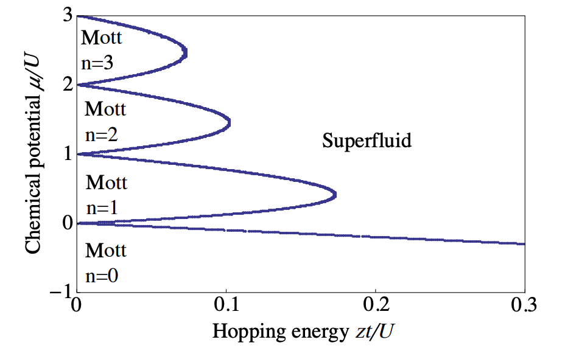

# Bose-Hubbard Model Gutzwiller Solver

[](https://opensource.org/licenses/MIT)
[](https://www.python.org/downloads/)
[](https://numpy.org)
[](https://scipy.org)
[](https://matplotlib.org)

## Overview

This repository implements the Gutzwiller mean-field approximation to solve for the quantum phase transition in the Bose-Hubbard Model. The Bose-Hubbard model describes bosonic particles on a lattice and exhibits a quantum phase transition between Mott insulator and superfluid phases as the ratio of hopping strength to interaction strength is varied.



## Features

- **Phase Diagram Generation**: Calculates and visualizes the phase diagram in the J/U vs μ/U plane
- **Order Parameter Analysis**: Computes the superfluid order parameter across the phase transition
- **Number Statistics**: Analyzes number fluctuations to identify phase transitions
- **Mott Lobe Boundaries**: Maps the boundaries between Mott insulator and superfluid phases
- **Variational Optimization**: Implements efficient numerical minimization of the Gutzwiller energy functional

## Theory

The Bose-Hubbard Hamiltonian is given by:

$$H = -J \sum_{\langle i,j \rangle} (b_i^{\dagger} b_j + b_j^{\dagger} b_i) + \frac{U}{2} \sum_i n_i(n_i-1) - \mu \sum_i n_i$$

Where:
- $J$ is the hopping parameter (kinetic energy)
- $U$ is the on-site interaction energy 
- $\mu$ is the chemical potential
- $b_i^{\dagger}$, $b_i$ are creation/annihilation operators
- $n_i = b_i^{\dagger}b_i$ is the number operator

The Gutzwiller mean-field approach uses the variational ansatz:

$$|\Psi_G\rangle = \prod_i \sum_{n=0}^{n_{max}} f_i^{(n)} |n\rangle_i$$

Where $f_i^{(n)}$ are variational parameters optimized to minimize the energy.

## Installation

```bash
git clone https://github.com/yantim/bose_hubbard_gutzwiller_solver.git
cd bose_hubbard_gutzwiller_solver
pip install -r requirements.txt
```

## Requirements

- Python 3.6+
- NumPy
- SciPy 
- Matplotlib

## Usage

Basic usage:

```python
python bose_hubbard_gutzwiller_solver.py
```

This will generate the phase diagram and order parameter plots.

For custom parameters:

```python
from bose_hubbard_gutzwiller_solver import optimize_gutzwiller, calculate_order_parameter

# Set parameters
J = 0.05  # Hopping parameter
U = 1.0   # Interaction energy
mu = 0.5  # Chemical potential
z = 6     # Coordination number
n_max = 5 # Maximum occupation number

# Optimize Gutzwiller variational parameters
f_opt, energy = optimize_gutzwiller(J, U, mu, z, n_max)

# Calculate order parameter
phi = calculate_order_parameter(f_opt, n_max)
print(f"Superfluid order parameter: {phi}")
```

## Examples

The repository includes examples showing:

1. **Phase Diagram**: Full J/U vs μ/U phase diagram showing Mott lobes
2. **Order Parameter Scaling**: Behavior of the order parameter near the phase transition
3. **Number Fluctuations**: Analysis of number variance across the transition

## Contributing

Contributions are welcome! Please feel free to submit a Pull Request.

## Citation

If you use this code in your research, please cite:

```
@software{bose_hubbard_solver,
  author = {Your Name},
  title = {Bose-Hubbard Model Phase Transition Solver},
  year = {2025},
  url = {https://github.com/yantim/bose_hubbard_gutzwiller_solver}
}
```

## License

This project is licensed under the MIT License - see the LICENSE file for details.

## References

1. Fisher, M. P. A., et al. "Boson localization and the superfluid-insulator transition." Physical Review B 40.1 (1989): 546.
2. Rokhsar, D. S., and B. G. Kotliar. "Gutzwiller projection for bosons." Physical Review B 44.18 (1991): 10328.
3. Sachdev, S. "Quantum phase transitions." Cambridge University Press (2011).